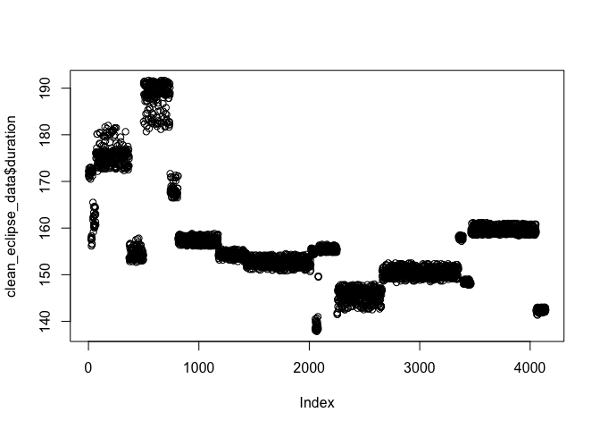

<!-- README.md is generated from README.Rmd. Please edit that file -->

# solarEclipses

<!-- badges: start -->
<!-- badges: end -->

The goal of solarEclipses is to provide easy access to clean and
structured data on solar eclipses for analysis and visualization. This R
package includes detailed information on various types of solar
eclipses, such as total and annular eclipses, along with their key
attributes, including date, location, duration, and name.

## Installation

You can install the development version of solarEclipses from [GitHub](https://github.com/) using the `remotes` package with:

``` r
# Install.package("remotes")
remotes::install_github("ETC5523-2024/assignment-4-packages-and-shiny-apps-Fengz924", subdir = "solarEclipses")
```


## Example

This is a basic example which shows you how to load the dataset.

``` r
library(solarEclipses)
data("clean_eclipse_data")
```

The following code allow you to see the summary of the dataset:

``` r
summary(clean_eclipse_data)
#>     state               name                lat             lon         
#>  Length:4141        Length:4141        Min.   :27.22   Min.   :-124.45  
#>  Class :character   Class :character   1st Qu.:34.79   1st Qu.: -97.30  
#>  Mode  :character   Mode  :character   Median :38.54   Median : -89.08  
#>                                        Mean   :37.76   Mean   : -91.06  
#>                                        3rd Qu.:41.09   3rd Qu.: -83.68  
#>                                        Max.   :46.91   Max.   : -67.43  
#>   eclipse_1          eclipse_2          eclipse_3          eclipse_4        
#>  Length:4141        Length:4141        Length:4141        Length:4141       
#>  Class :character   Class :character   Class :character   Class :character  
#>  Mode  :character   Mode  :character   Mode  :character   Mode  :character  
#>                                                                             
#>                                                                             
#>                                                                             
#>   eclipse_5          eclipse_6            duration         Type          
#>  Length:4141        Length:4141        Min.   :137.8   Length:4141       
#>  Class :character   Class :character   1st Qu.:150.7   Class :character  
#>  Mode  :character   Mode  :character   Median :154.3   Mode  :character  
#>                                        Mean   :157.2                     
#>                                        3rd Qu.:159.2                     
#>                                        Max.   :191.7
```

You can also embed plots, for example:
``` r
plot(clean_eclipse_data$duration)
```

<div class="figure">


<p class="caption">
Plot showing eclipse durations by geographic locations.
</p>

</div>


## Shiny
The `solarEclipses::launch_app()` function starts an interactive Shiny application that allows users to explore data related to solar eclipses visually. 
``` r
solarEclipses::launch_app()
```


The pkgdown site can be access through this link: [solar Eclipses](https://etc5523-2024.github.io/assignment-4-packages-and-shiny-apps-Fengz924/)
